## Reliving a Childhood: Addendums

**I wanted to write much more often. I really did, but as it's usually the case with blogs, you need both motivation and something to write about. I will admit it took some time, but now I seem to finally have both!**

*Originally published on the 19th of July, 2020.*

It's been half a year since I published [my first article](childhood.html), and in the meantime a lot of things changed; things which I wanted to document in post. To begin with, I switched to a different music player.

### Goodbye WACUP, hello foobar2000

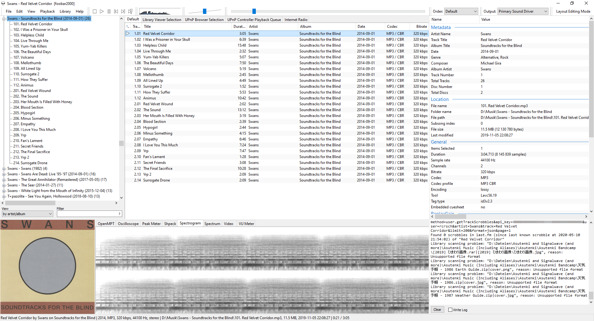

This is [foobar2000](https://foobar2000.org/), one of, if not the most customizable media player for Windows. I recently explained why I switched from [WACUP](https://getwacup.com/) in a [comment on Reddit](https://www.reddit.com/r/musichoarder/comments/gostq8/aimp_or_foobar2000/frizxbi), but in short:

- It's faster.
- It's more customizable.
- It has more features.
- It's more stable.
- There are more plugins.

And of course I want to elaborate on that last point.

### Goodbye vgmstream, hello... vgmstream

WACUP already shipped with vgmstream, but because foobar2000 is meant to be customized by the user, and as such doesn't include any third-party modules, we'll have to install it manually.

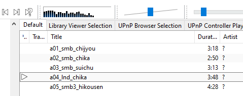

To do that, we can simply go to vgmstream's [shiny new website](https://vgmstream.losno.co/) and follow the steps below "foobar2000". That's it! The page also has instructions for [Winamp](https://winamp.com/) (which, of course, also works with WACUP), [XMPlay](https://xmplay.com/) and [Audacious](https://audacious-media-player.org/). It is also available as a command-line decoder, which, *by the way,* you could *also* use because there is a [plug-in](https://www.foobar2000.org/components/view/foo_input_exe) that lets you manually specify standalone decoders!

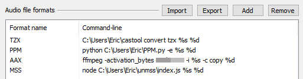

I'm honestly still baffled by the amount of – how foobar2000 calls them – components available. For starters, you can get a list [on the official website](https://www.foobar2000.org/components), but there are a lot more that weren't submitted by their authors and, as a result, can't be found there.

### Dumping music from Switch games

In my [previous post](childhood.html), I briefly mentioned the Super Smash Bros. Ultimate soundtrack which, when coverted to FLAC files, took up 27 GB in storage, while the raw LOPUS files only needed 1,2 GB.

Now, one might ask how to dump these LOPUS files for themselves, and it's a valid question – not all games see official soundtrack releases, and while you'll likely be able to find an [MP3 or FLAC game-rip](https://www.sittingonclouds.ru/), raw files are usually much harder to come by, simply because most people don't care what format their music in.

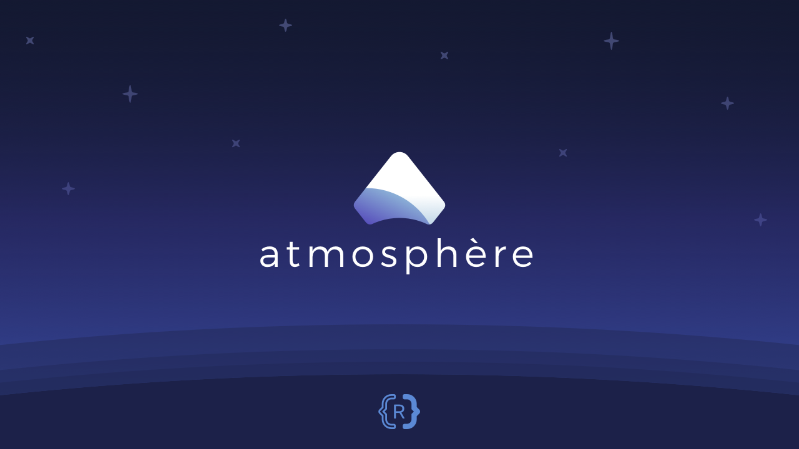

Here's how. First off, you *will* need a Switch, with the actual game installed onto it, as well as a way to run Homebrew software on that Switch (usually done via a custom firmware, such as [Atmosphère](https://github.com/Atmosphere-NX/Atmosphere/)).

You also need your encryption keys saved to `/switch/prod.keys` – you'll probably want to use [Lockpick_RCM](https://github.com/shchmue/Lockpick_RCM) for this.

(I should really write an article about the whole Switch hacking scene, but for now, if you want to learn more, you should check out either the [SD Setup Guide](https://switch.homebrew.guide/) or the [NH Switch Guide](https://nh-server.github.io/switch-guide/).)

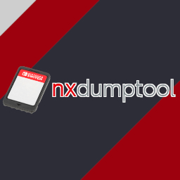

Anyway, once you've got that going, grab the latest release of [nxdumptool](https://github.com/DarkMatterCore/nxdumptool) and place the NRO file on your SD card, usually within the `/switch` directory.

Now boot your Switch, launch the Homebrew menu and start nxdumptool.

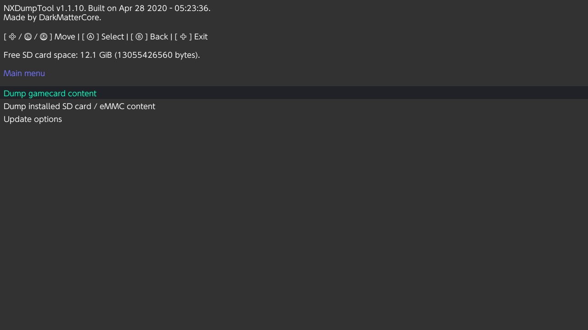

You can now choose to either "dump gamecard content" or "dump installed SD card / eMMC content" – both options should be self-explanatory.

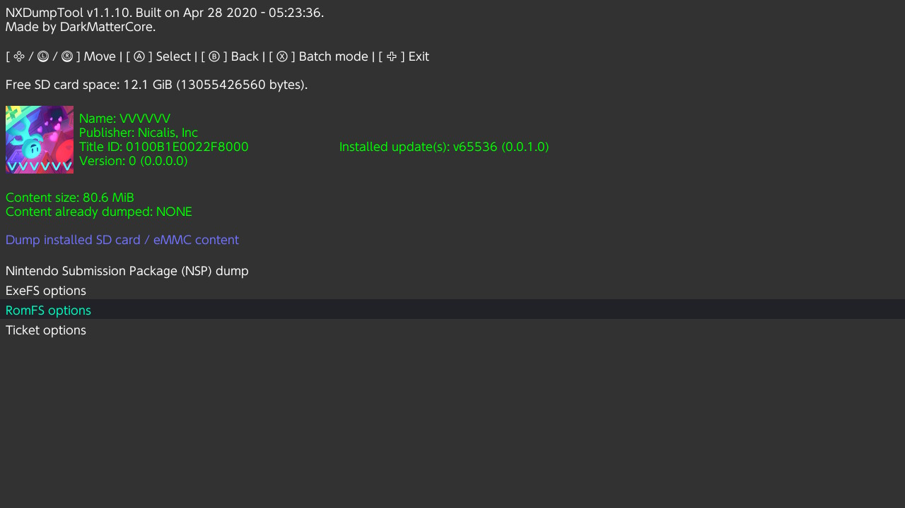

On the next screen, you'll be presented with multiple choices:

- Nintendo Submission Package (NSP) dump  
  This will package and dump the entire game into an .NSP file, which are commonly used to ~~pirate~~ make backups of games. You can still extract data from these files later, but I found it to be much easier to use nxdumptool's inbuilt function.
- ExeFS options  
  Allows you to extract parts or all of the **Exe**cutable **f**ile **s**ystem, which holds basic content related to the game. (I wish I knew more about this.)
- RomFS options  
  This is what you want to select. Allows you to extract parts or all of the **R**ead-**o**nly **m**emory **f**ile **s**ystem, an extension of sorts to the ExeFS, which holds all the juicy stuff and media like graphics and music.
- Ticket options  
  Allows you to, uhhh... [do things with the game's encrypted title key](https://switchbrew.org/wiki/Ticket).

Again, select "RomFS options", and you will be greeted with two more options, along with some settings that you can usually leave as-is:

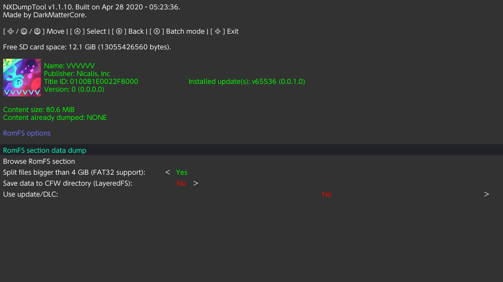

- RomFS section data dump  
  Dumps the entire file system. Recommended if you want to grab, for example, an entire soundtrack.
- Browse RomFS section  
  Starts a file browser within the RomFS allowing you to extract single files. Useful if you want to, say, dump single tracks.

Selecting the former will start the dumping process immediately.

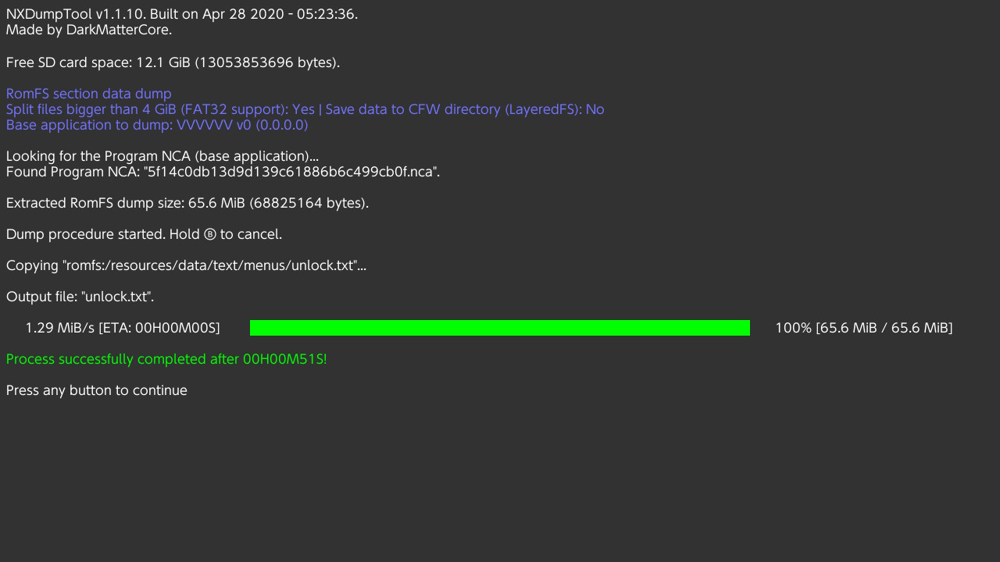

The file browser shown when choosing the latter looks like this. Note the controls explained at the top:

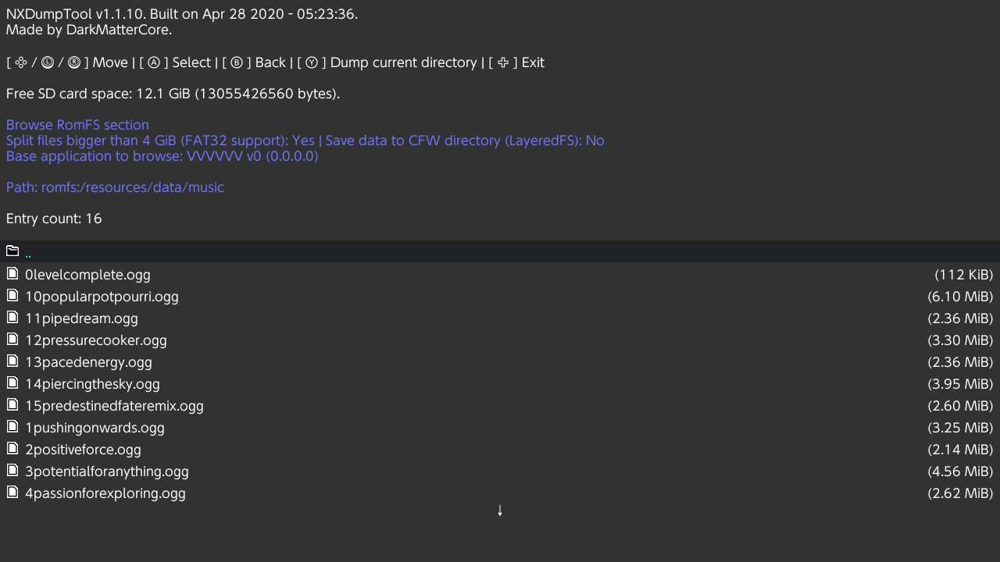

Selecting a file will do just what you'd expect:

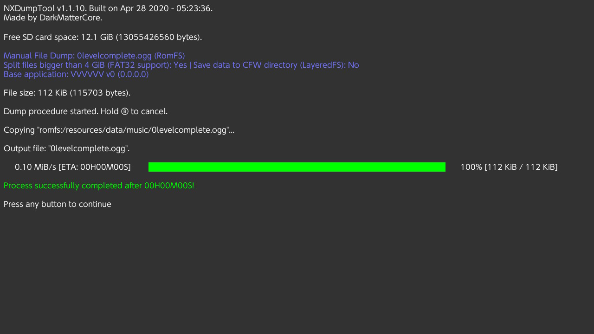

The extracted data will be stored in either `/nxdumptool` or `/switch/nxdumptool` on your SD card. So go ahead, put it in your PC (or use an [MTP server](https://github.com/retronx-team/mtp-server-nx)!), and you'll be good to go.

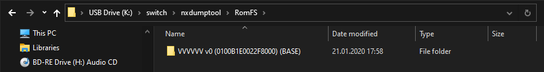

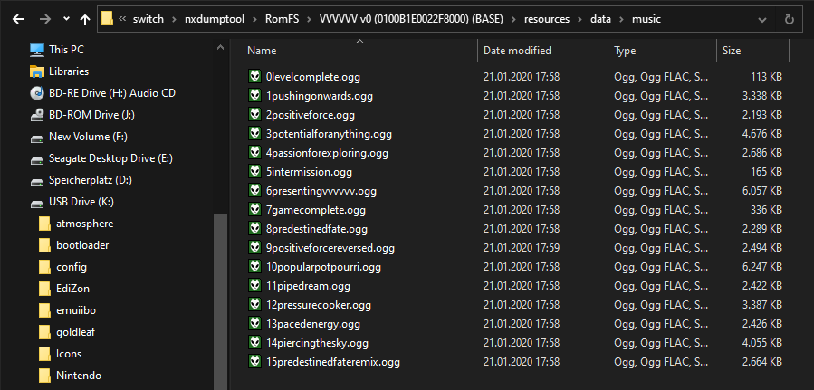
