## Reliving a Childhood Through Music

**I don't remember a lot from my childhood. Everyone I know, regardless of their age, seems to be able to recall every little event that happened during their lives. I don't.**

*Originally published on the 21st of November, 2019.*

I used to think of this fact as a bad thing, and it was only this year when I realized that the loss of those events made the ones I do remember a lot more special for me. Kind of like how most blind people can hear a lot better than normal people. I guess.

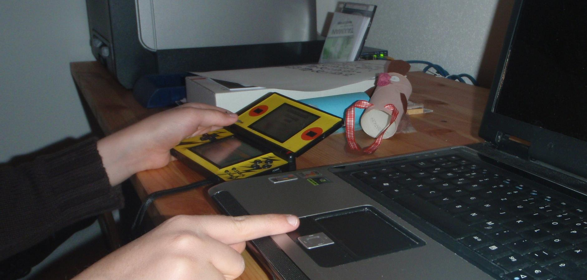

On my tenth birthday, I was gifted a Nintendo DS Lite, and some of those special memories were made using just that: *The first console I ever owned.*

### On the Beach at Dusk

Two games I remember playing a lot are [New Super Mario Bros.](https://www.giantbomb.com/new-super-mario-bros/3030-8224/) and [Pokémon Mystery Dungeon: Explorers of Time](https://www.giantbomb.com/pokemon-mystery-dungeon-explorers-of-darknesstime/3030-21294/) – both occasionally in co-op and versus modes together with a friend of mine.

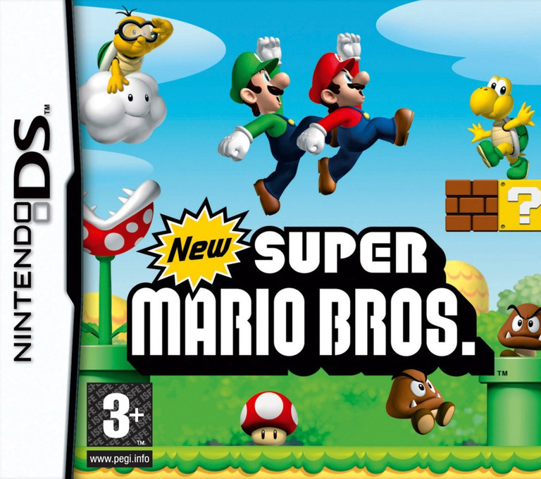

We used to beat each other's ass in NSMB's multiplayer mode. We also took a look at some of the minigames every now and then. I still have a lot of recordings of us playing against each other. My best guess is that I wanted to be a “let's player” back then, which on one hand still makes me cringe today (I mean, I recorded my DS's top screen with an old digicam, what the hell), but on the other I now have a lot of footage that I still view every so often.

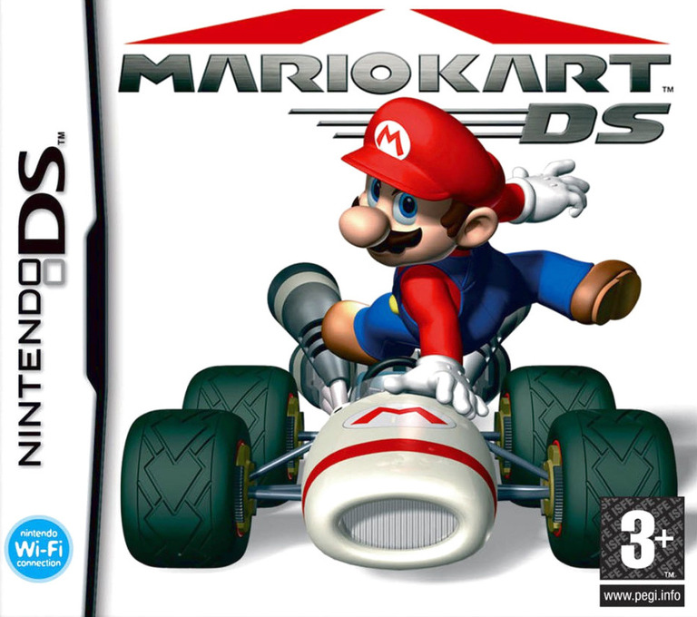

That footage was not restricted to NSMB though. At one point we were playing Mario Kart DS (I didn't own the game, but my friend did, and the DS had a feature where you could send temporary demos to each other, *how cool was that*) and it was my friend's turn selecting a track. He selected [Mario Circuit 1](https://mariokart.fandom.com/wiki/Mario_Circuit_1), but for some reason my device thought he decided on [Cheep Cheep Beach](https://mariokart.fandom.com/wiki/Cheep_Cheep_Beach).

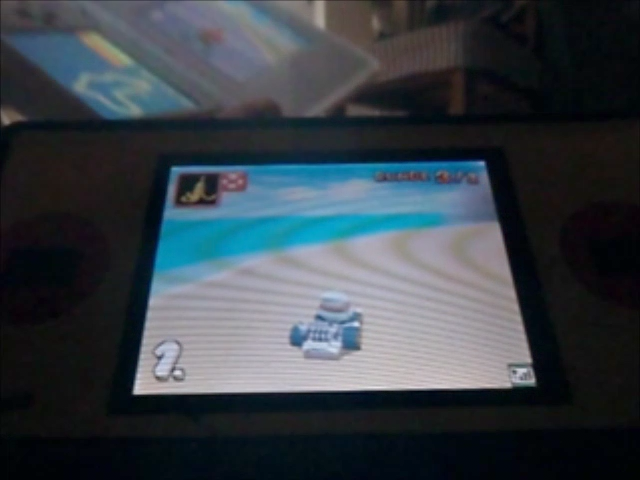

We only noticed after my friend asked me why I kept driving against a wall, and even then it took us another minute to figure out what was going on. We could hardly stop laughing or finish our tracks (especially because our games crashed a minute later) – *and I had everything on camera.*

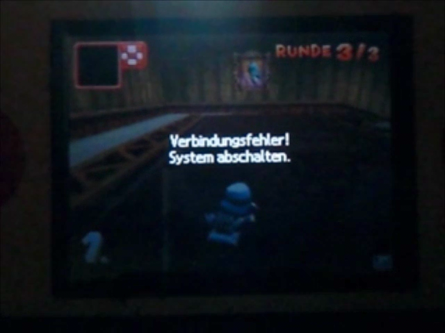

### I Saw Something Again…

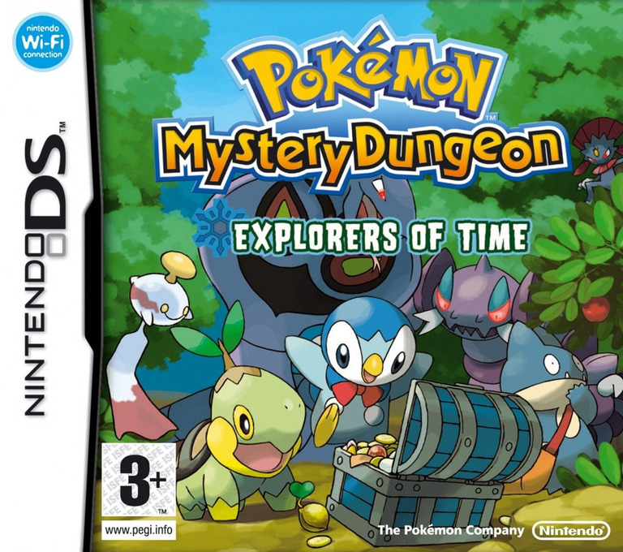

Explorers of Time was probably the most affecting game I played until now, and I doubt that that will ever change. I would love to talk about its story, but I don't want to rob you of the (absolutely amazing) experience in case you haven't played it yet. I finished the game over at my friend's house, and damn. I cried. I rarely cry because of movies or games – I somehow never did – but this one hit me hard. A few weeks later, we were meeting up at my house, and my friend finished it. Guess what he did.

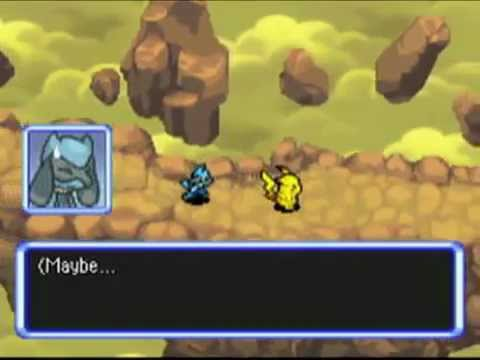

Over the years I played a few games that did make me feel empty after finishing them, but none of them were even coming close to what Explorers of Time had done.

Look, I could go on and on talking about this game and how much I love it, but I think you get the point: *Beating this game was one of those special, vivid moments for me.*

### Through the Sea of Time

Now, one might ask, “if you want to revisit those games, why not just play them again”, and I'd reply that you do have a point. But here's the thing: Once you finished playing a game that you had a strong emotional response to, you don't want to play it again. Sounds weird, I know. I remember reading about this some time ago, apparently it's some kind of defense response from your body. Fortunately, I have found a better way: *music.*

Once your hear the title theme of your favourite game (or movie, or show, doesn't really matter), you instantly begin to see it before your eyes. You start to remember the story, the characters and the world around them.

Try it right now. Seriously. I'll still be here when you're done. After all, I'm just a wall of text.

Interesting, isn't it? I always saw this as obvious, but it's really not if you think about it.

### Time Restored

Where did you look for the soundtrack of your choice when I asked you to do so two paragraphs above? Probably YouTube, maybe Spotify. And that's totally fine! If I just want to look up one song real quick, that usually does the trick for me as well. However, if I do decide that I want to get a whole soundtrack album, saving it on Spotify just isn't enough for me – if the soundtrack in question is even available there. Most aren't, especially those for older games.

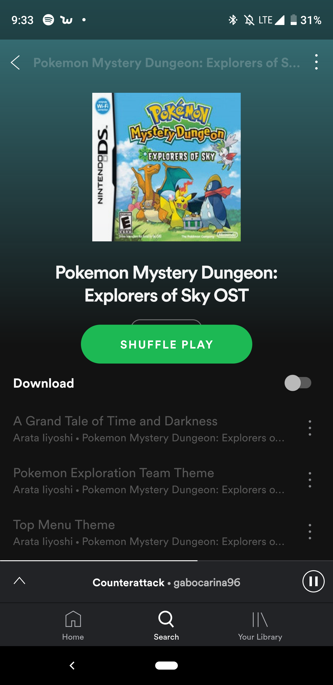

So let's try to get the soundtrack for that game I've been talking so much about. Oh great, it's on [KHInsider](https://downloads.khinsider.com/game-soundtracks/album/pokemon-mystery-dungeon-explorers-of-sky). Thanks for reading!

### Don't Ever Forget…

Just kidding. They just have MP3s. I want to get as close to the source and a quality as high as possible, so let's keep looking.

The [MysteryDungeon subreddit](https://www.reddit.com/r/MysteryDungeon/) has some download links for various soundtracks. Most of them are in MP3 as well, some are in a lossless FLAC format. Better already, but we can get even closer to the original.

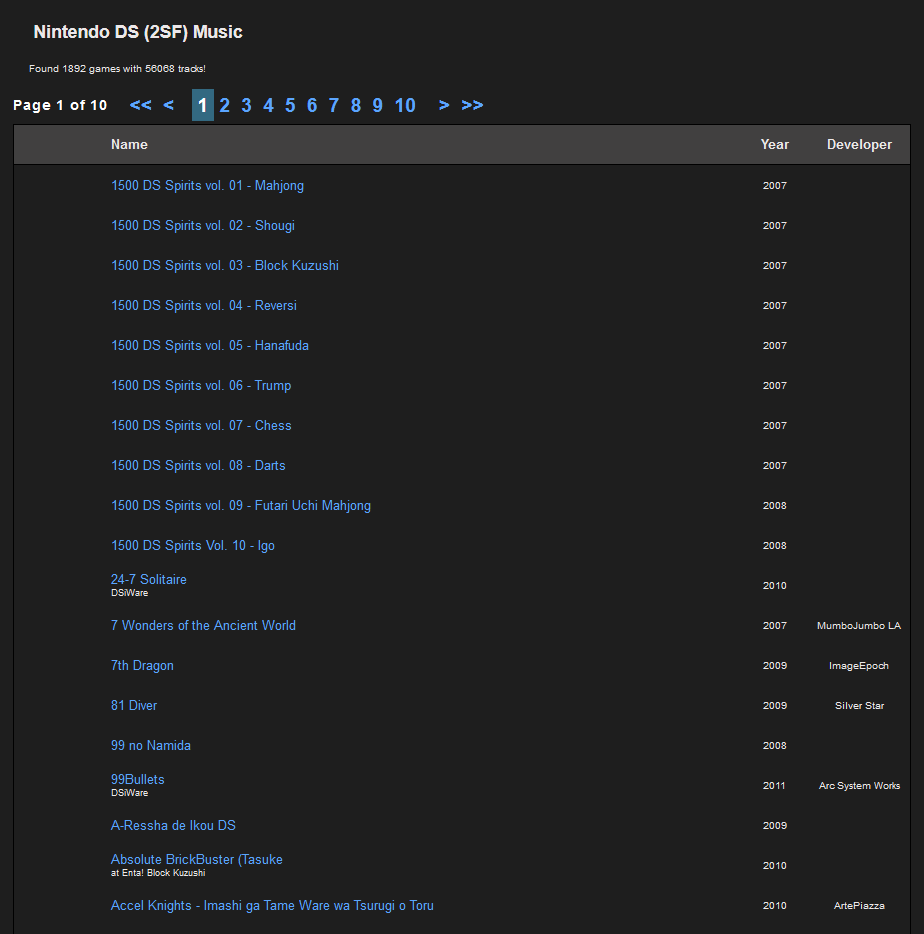

Enter [Zophar's Music Domain](https://www.zophar.net/music): a vast and extensive collection of video game soundtracks. This is not your usual soundtrack site, because in addition to MP3s we can also find the original game files here. (These are not close to the source. *They are the source.*) [And look what they got!](https://www.zophar.net/music/nintendo-ds-2sf/pokemon-mystery-dungeon-explorers-of-time-darkness)

*Edit: I also just learned about [this nameless site](https://vgm.hcs64.com/), which also hosts soundtracks in their original format.*

Most, if not all, games for Nintendo consoles use some kind of weird format that no normal person knows about. DS games, for example, use a variety of different formats and codecs – but you won't find any MP3s being used here. I highly recommend this [GBAtemp post](https://gbatemp.net/threads/the-various-audio-formats-of-the-ds.305167/) by user FAST6191 for further reading on those formats.

Mystery Dungeon, specifically, uses 2SF files. A lot (all?) of Nintendo's DS games do. Looking at Zoophar's page for the game, we can already see one aspect that speaks for 2SF files:

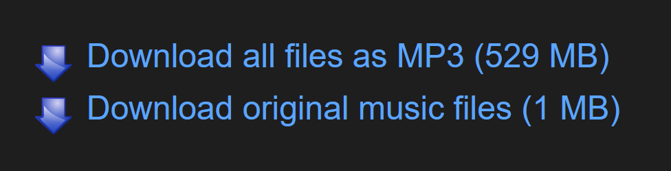

Keep in mind that those 529 MB are MP3 files – FLACs can easily take up twice as much space.

The second aspect and, for me, the most important one as well, is that these files give me a feeling of integrity. Everyone can open MP3s in Audacity and modify them in any way they want. Because raw game files like 2SFs are so rare, no convential program supports playing, let alone editing them.

### Farther Away…

We got some 2SF files. Now how in the world are we going to listen to them?

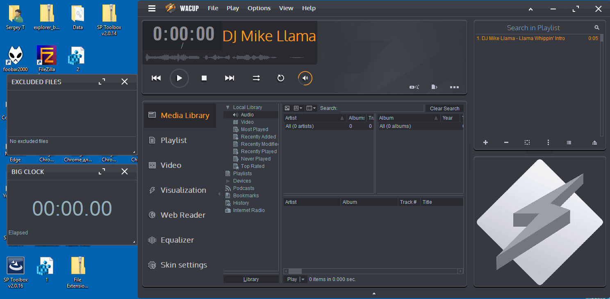

This is [WACUP](https://getwacup.com/). It's like Winamp (because it's based off of it), but adds a ton of improvements and new features. One of these features is the inclusion of [vgmstream](https://hcs64.com/vgmstream.html), which, in turn, is a plugin for Winamp and foobar2000 that adds support for a lot of various video game music formats. And when I say a lot, [I mean a lot.](https://github.com/losnoco/vgmstream#supported-codec-types)

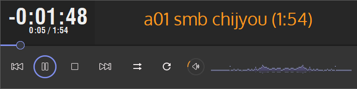

I use it primarily for playing LOPUS files, which are used by the Nintendo Switch. Not so retro, I know. But again: [Someone on /r/SmashBrosUltimate](https://www.reddit.com/r/SmashBrosUltimate/comments/cloiag/super_smash_bros_anthology_complete_enhanced/) onverted the entire soundtrack to FLAC files – and they're 27 GB in size. The LOPUS files? *About 1.2 GB.*

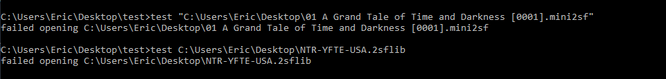

It's an incredible piece of software, but one thing it can't do (yet) is open 2SF files. I wanted to mention it anyway, since it's pretty much the flagship for every other format out there.

So, for those files, we'll use Christopher Snowhill's [vio2sf](https://bitbucket.org/kode54/vio2sf/src/master/) plugin. This one is not shipped with WACUP by default, but a download link can be found on – surprise! – [Zophar's Domain.](https://www.zophar.net/utilities/2sf/vio2sf.html) There's also a plugin called [in_2sf](https://www.cyberbotx.com/in_2sf.7z), but I haven't tried it yet (since vio2sf works perfectly), and you can't really find anything about it online.

To install vio2sf, extract the ZIP, drop the files into WACUP's plugin directory and you should be good to go! If you need any help, make sure to check out the included TXT file for more detailed instructions.

### A Wish for Peace

Dope, we can now listen to 2SF files just like any other audio file! But there's one last thing I want to cover.

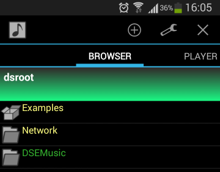

I listen to a lot of music when I'm on the go, mainly while commuting, but I can't take my computer with me everywhere I go. So how do I listen to these files on my phone? Well, let's check out another program/app: [Droidsound-E!](https://web.archive.org/web/20170926123431/https://droidmjt.github.io/Droidsound/) Don't be afraid of it being an archived page, the [GitHub repository](https://github.com/droidmjt/Droidsound) is still alive (and active)!

FYI: Droidsound-E is a fork of the discontinued [Droidsound](https://web.archive.org/web/20150929000048/http://swimsuitboys.com:80/droidsound/) application ([GitHub repository](https://github.com/sasq64/droidsound/)). Not that important, but I still thought that I should mention this.

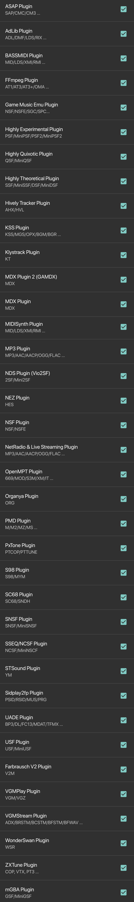

The bad news is that Droidsound-E doesn't support any external plugins, but the good news is that it includes both vgmstream and vio2sf, so you don't even need any!

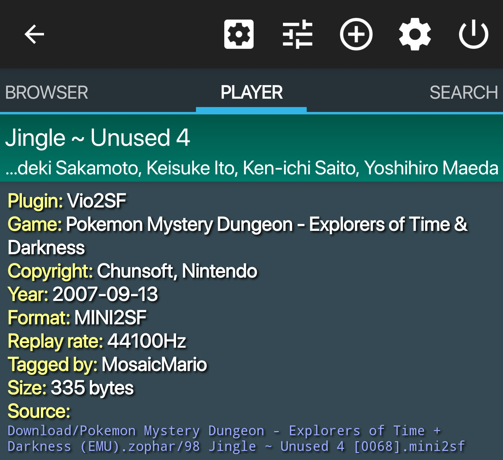

### Do Your Best, As Always

And there you have it: the ability of playing old video game music both on your computer and Android phone, in the best quality possible, and without the files taking up all of your storage.

I apologize for any weird wording or confusing language, it's late as hell and I need to get some sleep, but I really wanted to finish this beforehand.

If you have any questions or want to talk to me about this, feel free to reach out to me via Twitter. Thank you for reading!
