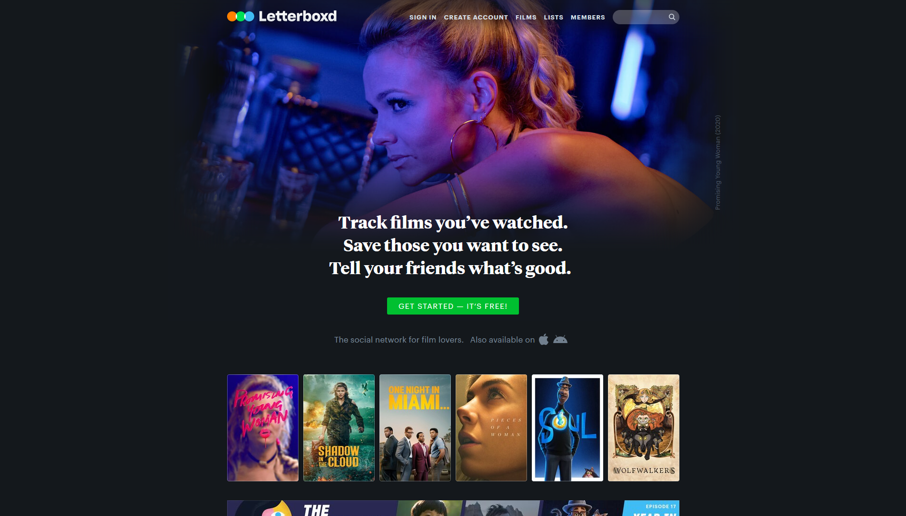
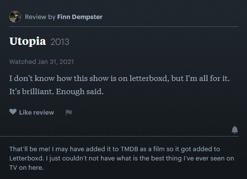
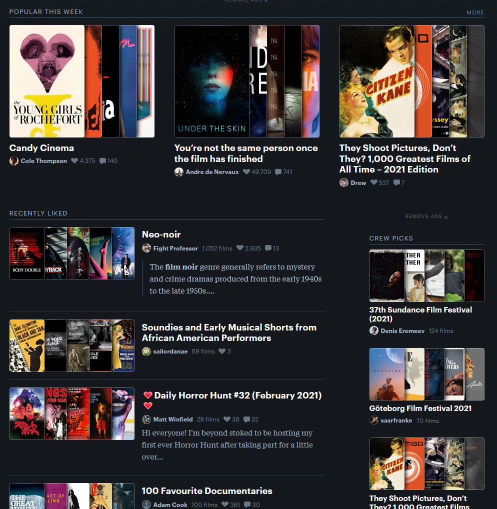
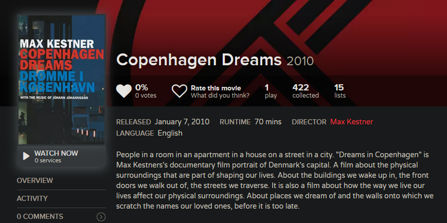
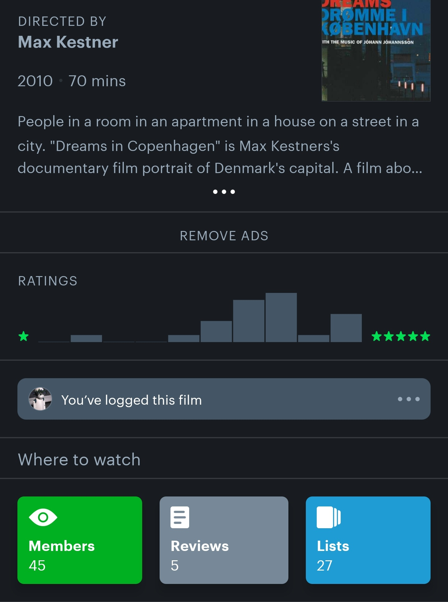
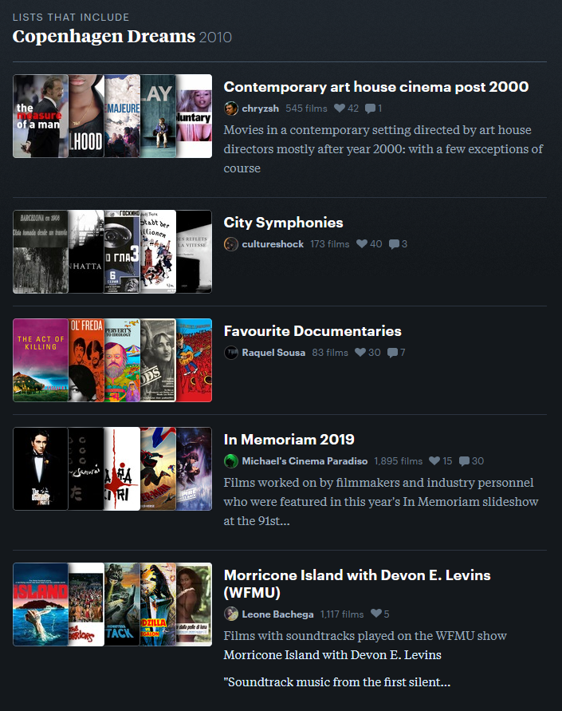
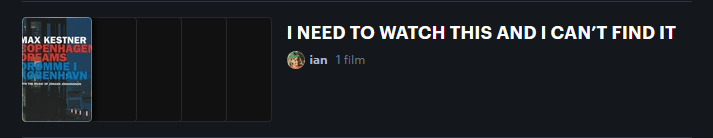
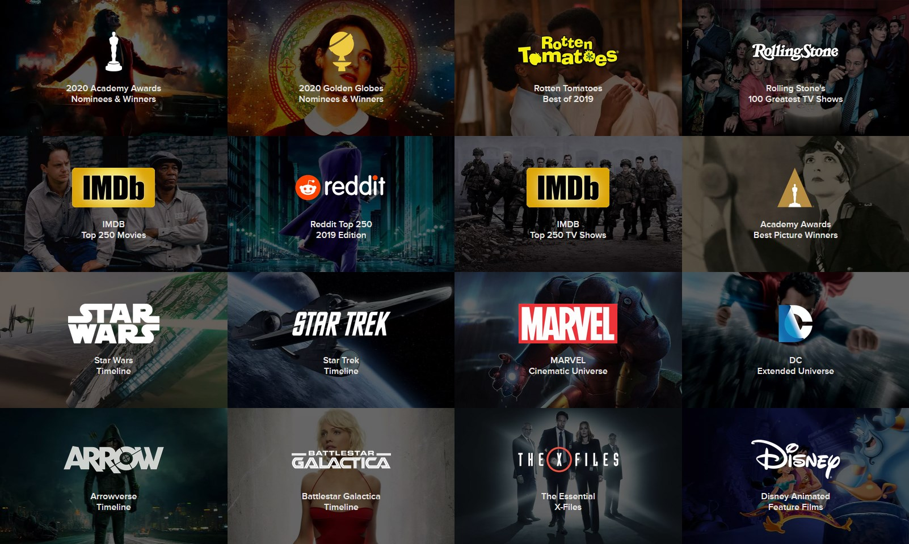
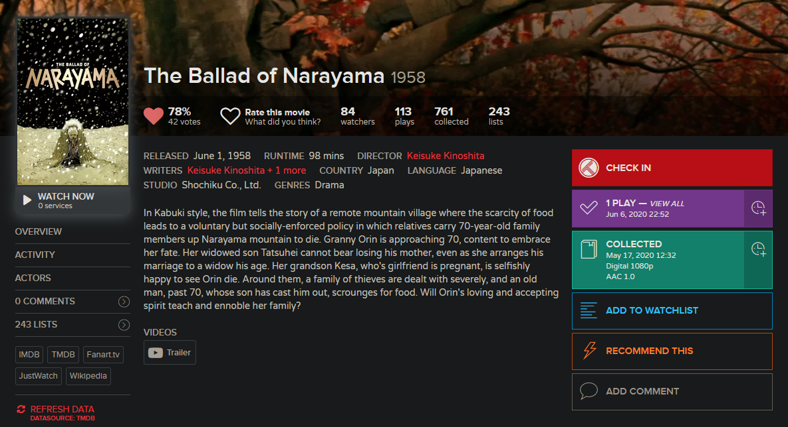

## Great Are the Stars

**Yes! I'm doing it again. It took me a while to figure everything out – too long, in fact; I'm already one month late, but then again, last time I was three months early. So here's to the next 365 days and beyond.**

*Originally published on the 2nd of February, 2021.*

I'm going to be honest, things have not been going well. The reasons behind this are still too personal, even for this blog, but one result of this – and definitely the one I noticed the most – has been me losing motivation for just about everything. I don't make programs, scripts, designs, music or games anymore. Work isn't fun. I'm legitimately surprised this post isn't a total mess just yet.

It's only gotten worse with time, and I finally decided it's about time to do something. *Anything.*

### And Humankind Is of No Account to Them

Sooner rather than later, my thoughts went to the retrospectively yet adequately titled ["Sleep on the Floor" challenge](https://rateyourmusic.com/list/Rossmann/sleep-on-the-floor-365-days-365-albums/). Back in 2020, I had already thought about doing a similar challenge the year after, [perhaps with books or movies](https://blog.rxyz.rocks/posts/year-of-hibernation#the-future-wouldnt-that-be-nice). In January, I dismissed that thought rather quickly – not enough time.

The average album sits somewhere between 30 and 60 minutes. While listening to the music you can do something else, like *finally cleaning that damn room.* And if it weren't for [me having to work from home for a few weeks thanks to COVID-19](https://blog.rxyz.rocks/posts/year-of-hibernation#the-numbers), I'd probably be talking about this challenge in a very different way now.

The average movie is about 90 to 120 minutes. Unless it's a really bad one, you probably want to pay attention the entire time. There's no forced home-office in sight (which, don't get me wrong, is also a good thing). I ~~shouldn't~~ can't really watch one while at work. Watching two movies in one day is weird. And how the hell am I going to find so many movies?

I may have an answer to that last question.

### But Humankind Is a Fair Spirit

For as long as I can remember, I've been using [Trakt.tv](https://trakt.tv/) to track the films and shows I watched. I don't even know where I first heard about it. I just did, started using it, and that was that.

Recently, a few friends of mine let me know that [Letterboxd](https://letterboxd.com/) is a thing. Occasionally they would share their profiles, movies they'd watched or reviews they'd written. And I thought: "Fine, apparently no one uses Trakt and Letterboxd is the hot new shit. I should probably make an account." After all, I was interested in what they were watching, what they liked. So I did. I [imported my history](https://github.com/anoopsankar/Trakt2Letterboxd) – and, oh boy, I realized that I was right. Letterboxd *was* the hot new shit.

### Whom a Star Conceived

Letterboxd isn't perfect. Far from it. The experience of tracking and rating movies on their platform is amazing (though it takes a while to adjust to it), but tracking TV shows is, depending on the show, kinda stupid or literally impossible.

*Yeah, it's ugly.*

See, Letterboxd was made for movies, so you could only rate movies. But as the userbase grew, so did their demands. Fast forward to now, and Letterboxd is in this weird state where some shows are listed as movies with hundreds or thousands of minutes of runtime, some have listings for every episode (with no link between them despite their name), and some aren't listed at all.

You also can't automatically track what you watch. Trakt.tv has integrations for Plex, Kodi, Emby, Netflix, VLC, what have you, that automatically detect what you're playing and send that data over to Trakt. Letterboxd's API is still in a private beta.

You *also* can't catalogue the movies you own unless you subscribe to one of their premium tiers. Then again, I suppose if this was that important to me I'd have opened my wallet already.

Because of this, I have decided to – at least for now – stick to both Trakt.tv and Letterboxd. Why both? Well, if you have a guess, it's probably correct, and if you use Letterboxd yourself, you already know – *the damn lists.*

### And a Star Kills

You see, back in 2020, when I wanted to find new music, I would usually log on to [Rate Your Music](https://rateyourmusic.com/) and click the "Lists" tab. Upon doing so, I would be greeted with countless collections of releases, sometimes spanning only three or four albums, and sometimes encompassing multiple thousands. These lists were created by users of the site, and there was, arguably, one for absolutely everything. It won't stop snowing? [Check this out.](https://rateyourmusic.com/list/Sly_Wank/releases-best-suited-for-winter-listening/) Need some music for your next Dungeons & Dragons session? [We got you covered.](https://rateyourmusic.com/list/TheScientist/rym-ultimate-box-set-dungeon-synth/) In the mood for a laugh? [Of course you are.](https://rateyourmusic.com/list/emojiarchive/bands_artists-named-after-a-medical-condition-that-i-have-whenever-i-listen-to-them/)

The reason for the huge amount of lists was, of course, the equally huge amount of users. If you spend time in any online music community, you will hear about Rate Your Music sooner rather than later, and after doing so, you will probably make an account. Fast forward a few weeks and you'll have your first list – it may not be that good, but it's a start.

I don't have any numbers or statistics on the userbase of Trakt.tv or Letterboxd, but it becomes extremely clear that the latter has far more active users by comparing a few movies. For example, let's take the insanely unknown *Copenhagen Dreams* (in fact, it's so unknown that it is often listed under a different name: *Dreams in Copenhagen*).

On Trakt.tv, it has one play – mine. It's in 15 lists and has not a single review.

On Letterboxd, it has at least 45 plays, is in 27 lists and has five reviews – which still isn't that much because, again, it is so unknown, but it goes to show that even the most obscure flicks have an (albeit small) audience on this platform. But I digress.

### We Can Help You

Where were we? Ah, lists, of course! Going back to *Copenhagen Dreams* once more, here are the Trakt.tv lists that feature it at the time of writing:

- English Movies
- Movies 2010-2019
- All Movies
- 2010 English
- movies 2
- Disney+ Movies
- List of All Movies
- Watchlist
- Watchlist
- Watchlist
- Watchlist
- Watchlist

It is (quite obviously) not English but Danish, I don't think it's on Disney+ considering Disney had absolutely nothing to do with this, and *what the hell* is the purpose of "All Movies"? Oh, and I just noticed this, but it seems like three lists are private, so it's actually twelve lists this movie is in.

Here's an excerpt of the Letterboxd lists that feature it:

And, my personal favorite:

Talk about a difference in quality.

Letterboxd also allows you to (properly) browse lists, just like Rate Your Music, while what you get on Trakt.tv when you go to "Discover" and "Featured Lists" is just that, featured lists.

In my years of using Trakt.tv, I have yet to find a way to browse actual user's lists. In theory, you could use Google and do something like `site:trakt.tv inurl:lists`, but you get my point: I now know where I'll be getting my recommendations from.

### And We Need Your Help

This leaves me with one last problem – time. To combat this, I set myself three rules (or rather, loosened the existing ones) that should counteract this a bit:

- In my previous challenge, I would only count new albums; ones that I hadn't heard yet. This time, rewatches count too.
- Each episode of a TV show counts as a movie. This also solves the problem of consuming multiple films a day – let's hear it for binge-watching!
- I'll be doing 300 instead of 365 movies.

And that's where we're at right now. Yesterday, I actually watched *Copenhagen Dreams*, something I've been wanting to do for a while, and I'm excited. Who knows what I'll end up with in a year? Old Japanese movies no one's heard about? Just kidding, I'm already at that point.

You can follow my journey on [Trakt.tv](https://trakt.tv/users/roesch) or [Letterboxd](https://letterboxd.com/roesch/). Hope to see you there – and thanks for reading.
