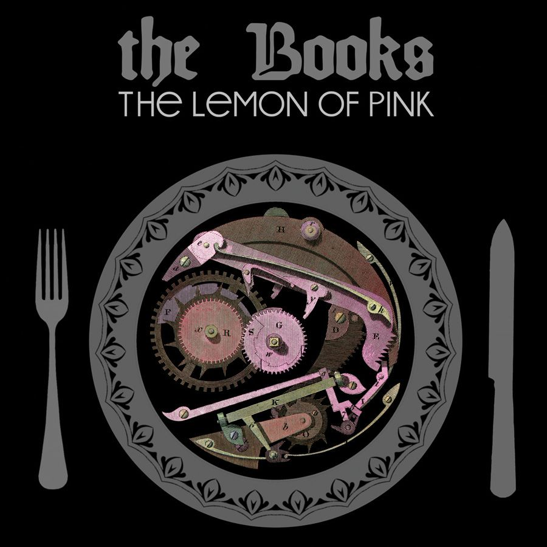

## The Year of Hibernation

**Over the past 365 days, I've been listening to 365 albums, EPs, and sometimes singles, which I've never heard before. I started just for fun – and finished having learned way more than I thought I would.**

*Originally published on the 4th of October, 2020.*

One year and two days ago, I started a challenge: I wanted to listen to 365 musical works I never heard before in 365 days – i.e.: one per day.

I previously discovered [Rate Your Music](https://rateyourmusic.com/), a music database, collection and rating site, thanks to a friend, and I was surprised at the sheer amount of *content* I was able to find through it.

Even back then, I was no stranger to music databases – I had used both [Discogs](https://www.discogs.com/) and [MusicBrainz](https://musicbrainz.org/) extensively in the past – but thanks to [lists created by other users](https://rateyourmusic.com/lists/), grouped more or less carefully into various categories, I was able to find albums that looked interesting to me much easier and faster.

At first, I checked out stuff that I was already listening to before, namely EDM and House, but I soon noticed that my musical horizon began to expand, and before I realized, I was listening to *Turntable Music*, *Drone Metal*, *Harsh Noise* and, of course, the all-encompassing *Experimental*.

### The Numbers

Each album I finished I added to [my own list](https://rateyourmusic.com/list/rcrsch/sleep-on-the-floor-365-days-365-albums/), along with the day I listened to it. I also kept track in a [spreadsheet](spreadsheet.xlsx), which made for some interesting insights:

You can clearly see when the pandemic started and I had to start working from home.

Some more random statistics:

- The longest album I listened to was [Welcome to Warp Zone!](https://rateyourmusic.com/release/djmix/nmesh/welcome-to-warp-zone) by [Nmesh](https://rateyourmusic.com/artist/nmesh), with a length of four hours and 20 minutes.
- My "high score" was six albums in a day, on both the 28th and 29th of April. There were also a lot of days where I didn't listen to anything.
- [Swans](https://rateyourmusic.com/artist/swans) were the most prominent artist in the list by far, with 26 releases, followed by [Current 93](https://rateyourmusic.com/artist/current-93) with only six albums. No surprise here, as I only discovered them at the end of last year and since then they've quickly grown into my favourite artist.
- 18 releases I listened to were so obscure, they weren't even in RYM's database, not including the ones I added myself.

This is where I would've put some additional stats, most popular/highest rated albums and all that jazz, but Rate Your Music has a rate limiting that's way too aggressive and I can't seem to work around it. So instead, let's move on to...

### The Picks

I think I made it pretty clear now that I listened to a lot of music during those last 365 days, and, by nature, some albums were better than others. It was pretty hard choosing only five albums from such a large list, but here we go:

#### 5. [Spiritualized - Sweet Heart Sweet Light](https://rateyourmusic.com/release/album/spiritualized/sweet-heart-sweet-light/)

You may only know Spiritualized for *Ladies and Gentlemen, We Are Floating in Space*, but they make some of the most beautiful and touching ballads I've heard, and SHSL contains not one or two, but three of my favourites.

It starts out with an intro I immediately fell in love with and, for the most part, continues with solid rock songs like *Hey Jane*, *Get What You Deserve* and *Headin' For The Top Now*. In between, however, sits *Too Late*, and at the very end of the album you have *Life Is A Problem* and *So Long You Pretty Thing*. You know, some of the ballads I mentioned.

> And I won't get to heaven  
> I won't be coming home  
> I will not see my mother again  
> 'cause I'm lost and I'm gone  
> And this life is too long  
> And my willpower's never too strong

#### 4. [Various Artists - Dark Was The Night](https://rateyourmusic.com/release/album/various-artists/dark-was-the-night/)

Surprise! This one is not an album in the traditional sense, but a compilation done for the Red Hot Organization, an international charity raising funds and awareness for HIV and AIDS. I wasn't sure whether to include this here, as I only discovered it a week ago, but whatever.

I was immediately interested when I first heard of it – after all, some of my favourite artists came together for this: [The Books](https://rateyourmusic.com/artist/the-books) (see below), [Bon Iver](https://rateyourmusic.com/artist/bon-iver), what would later become [Big Red Machine](https://rateyourmusic.com/artist/big-red-machine), [Iron and Wine](https://rateyourmusic.com/artist/iron_and_wine) and [Arcade Fire](https://rateyourmusic.com/artist/arcade_fire). I'm not entirely sure how I managed to avoid this up until now.

Said artists delivered some solid tracks, sure, but surprisingly my favourites came from people and groups I had never heard of before, namely [Sufjan Stevens](https://rateyourmusic.com/artist/sufjan-stevens)' epic cover of *You Are The Blood*, [Andrew Bird](https://rateyourmusic.com/artist/andrew_bird)'s beautiful rendition of *The Giant of Illinois* and [Jónsi & Alex](https://rateyourmusic.com/artist/jonsi_and_alex)' comforting *Happiness*.

With DWTN, you get a solid 130 minutes of Indie Rock, Folk and Pop – so you pretty much can't go wrong with this one.

#### 3. [The Books – The Lemon of Pink](https://rateyourmusic.com/release/album/the-books/the-lemon-of-pink-1/)

In my opinion, The Books didn't get nearly as much recognition as they deserved. You may have heard *Smells Like Content* before, but that's about it. Then again, their style is probably the most experimental on this list.

In each of their five releases, they combined traditional instruments and elements of Folk with electronic effects and glitches. Oh, and don't forget the samples.

It sounds weird and intriguing at first, but it works really well, especially in this release. Each track gives off a different astmosphere, sometimes soothing and comforting, other times adventurous and otherworldly.

I don't really have much more to say about this, so if you can spare just 40 minutes, go listen to it. It might be your new favourite album.

#### 2. [Swans – Deliquescence](https://rateyourmusic.com/release/album/swans/deliquescence/)

Ah, Swans. The group of which I've heard 26 new albums this year. How would I describe Swans to someone who's never heard of them? I wouldn't. I'd just show them.

Starting with [brutal No Wave Rock without any chords or melodies](https://rateyourmusic.com/release/album/swans/filth/), then leaning more towards [Experimental and Gothic Rock](https://rateyourmusic.com/release/album/swans/children-of-god/), before dropping a [two-hour monster of a release, mixing Post-Rock with Drone, Dark Ambient and Industrial](https://rateyourmusic.com/release/album/swans/soundtracks-for-the-blind/), they've done it all, changing their line-up for almost every album.

You won't find this release on Spotify or Bandcamp, as it was released only on a limited-edition CD. It consists of recordings of their "The Glowing Man" tour from 2016, and putting the feeling that you get from this album into words seems impossible for me.

If you're thrown off by the fact that this has a 45-minute opening track, you have every right to be. Somewhere between Post- and Noise Rock, *The Knot* stands as an absolute leviathan, consuming more and more of your mind with every passing second.

If you want to see what the fuzz is all about but don't want to spend 45 minutes doing so (although I highly recommend this), you should watch [this four-minute excerpt](https://www.youtube.com/watch?v=NxICmkwNOrw) instead.

That's not to say that the other tracks are bad, far from it. *Cloud of Forgetting* and *The Glowing Man* are absolutely devastating live renditions of already great tracks, and the rest doesn't disappoint either. Ironically, the semi-title track *Deliquescing* is the only one I can't really get into.

#### 1. [Youth Lagoon – The Year of Hibernation](https://rateyourmusic.com/release/album/youth-lagoon/the-year-of-hibernation/)

Kinda gave it away with the title, didn't I? While the other rankings took me a while to figure out, placing this, dare I say, masterpiece at number one was a no-brainer.

I only discovered this one thanks to Spotify, which started to play *17* after the album I initially listened to ended.

TYOH is what I'd consider the pinnacle of Dream Pop. The entire album with its highly filtered vocals and dream-like instruments sounds like one big childhood memory.

Starting off with *Posters*, which contains some of the best lyrics I've heard in a while, continuing with *Cannons*, which was more motivating than any quote I've seen or book I've read, and just *going on*, only falling slightly flat on the two bonus tracks, Trevor Powers delivers a fantastic debut album here.

TYOH combines beautiful progressions and sounds with lyrics that I could actually identify with for once. *July* is now number ~~six~~ ~~five~~ ~~four~~ three on my [all-time top tracks list on Last.fm](https://www.last.fm/user/rcrsch/library/tracks?date_preset=ALL). And if one year could be titled the "Year of Hibernation", it would be 2020.

Quoting [BBC Music](https://www.bbc.co.uk/music/reviews/5xgw/):

> It is both a captivating listen and a terrifying one: Powers was 22 this year, but his voice carries all the experience of a man thrice his age.

### The Future, Wouldn't That Be Nice?

[Ha, get it?](https://open.spotify.com/track/7051P5WbuQ8ljBwU05sGEl)

I guess what I want to say with this post is this: **There is so much great content out there. Go hunt it down.** I still have a long way to go before feeling comfortable saying I've heard a bit of everything, but you have to start somewhere. And somewhen.

I haven't yet decided whether I want to do the same challenge next year. Maybe I'll do *365 Days, 365 Movies*, or *52 Weeks, 52 Books*, who knows? A year ago I had no idea how much music was out there, and a year from now I might have just a little more experience in movies or books.

One thing is certain though: Even though Rate Your Music has pretty much become a meme between some of my friends and me due to its Y2K-era design and code, it may just be one of, if not the site that has influenced me the most over the past, you guessed it, [365 days](https://rateyourmusic.com/list/rcrsch/sleep-on-the-floor-365-days-365-albums).

*"I'd never manage to listen to 365 albums in a year though"*
