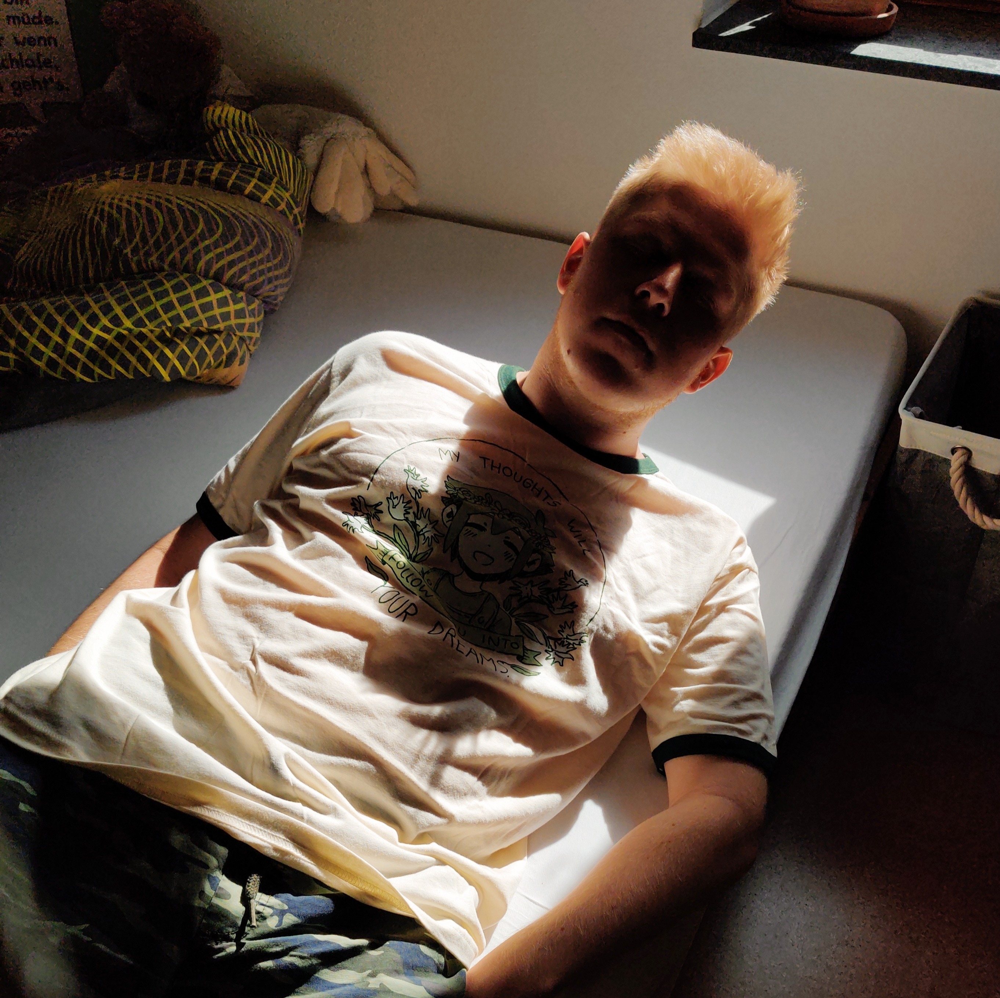

## Hi there! Hope you're doing well.



My name's Sunny (or Eric, whichever works), and I'm broadcasting this from ~~a Raspberry Pi, located near the Austria-Germany border~~ [Vercel](https://vercel.com/), which is actually pretty damn cool once you get the hang of it.

I usually work as an [application developer](code.html). Aside from that, I occasionally do [graphic design](design.html), video editing, [photography](photos.html) and more. I'm also into a lot of old technology (ZX Spectrum, MS-DOS, what have you) and console hacking (the cool kids call this "homebrew", right?).

Furthermore, I'm a strong advocate for:

- digitization and preservation
  - whether that may concern [books, cassettes, CDs, Blu-rays, other mediums or digital things](https://archive.org/details/@roesch)
- privacy
  - no more [Facebook, Google, Microsoft, Apple or Amazon](https://gafam.info/) accounts
- a greener planet
  - I highly recommend reading [The Uninhabitable Earth](https://openlibrary.org/books/OL28213233M/The_Uninhabitable_Earth) and [All The Right Words On Climate Have Already Been Said](https://therealsarahmiller.substack.com/p/all-the-right-words-on-climate-have)

On the more "passive" side, I sometimes [listen to music](https://www.last.fm/user/rcrsch), [watch a movie](https://letterboxd.com/roesch/) or [TV show](https://trakt.tv/users/roesch) or [play some games](https://steamcommunity.com/id/rcrsch).

If you couldn't already tell, I'm a big [OMORI](https://www.omori-game.com/en) fanboy in particular. That game just hit way too close to home, dammit!

If you'd like to know what I'm up to, you can follow me on [Twitter](https://twitter.com/rcrsch) (warning: mostly shitposts) or, if you're as nerdy as me, [twtxt](twtxt.txt) (warning: mostly inactive).

Lastly, I also have an e-mail address, but you know how it is these days. Try this:

```
echo cm9lc2NoLmVyaWNAcHJvdG9ubWFpbC5jb20K | base64 -d
```

Seriously though, feel free to contact me about whatever you want. I read everything! (And sometimes I reply too!)

My PGP key is pretty much everywhere at this point, you really can't miss it – but just in case, you can either [download the .ASC file](public.asc) or grab it here:

```
-----BEGIN PGP PUBLIC KEY BLOCK-----
xjMEXwsmGhYJKwYBBAHaRw8BAQdA56V3fT9av0oxNlaPE/JLZZVNAAYY8lE1e7Ed
QYfL+l7NKEVyaWMgUsO2c2NoIDxyb2VzY2guZXJpY0Bwcm90b25tYWlsLmNvbT7C
kAQTFggAOBYhBN3H3uYXtLCsikJTmxN3ojfYWmSyBQJfCyYaAhsDBQsJCAcCBhUK
CQgLAgQWAgMBAh4BAheAAAoJEBN3ojfYWmSyH9kBALSq1es0uAb2UzprD2VQ22BJ
hF7NjXCP+eJT3CwFbZJaAP92LXLbURzR0MOhWfRXXHfREn8/s10eH0PRLtqDPjqn
Ac44BF8LJhoSCisGAQQBl1UBBQEBB0AGKQhH+re2eSyVFZI6A+LRA/geCxkcGDOo
7DPnbJbzdAMBCAfCeAQYFggAIBYhBN3H3uYXtLCsikJTmxN3ojfYWmSyBQJfCyYa
AhsMAAoJEBN3ojfYWmSyc8oA/17bKNxzIeVx7j96oq/+YiVQj5bFfw8myEycJY+/
xQ65AQCl0Y/mhwMbIciq6zX2XncqGpMTmovQ92Uot4Cv6QNgCw==
=6VjV
-----END PGP PUBLIC KEY BLOCK-----
```
