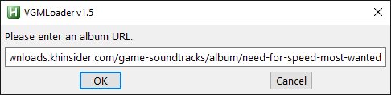
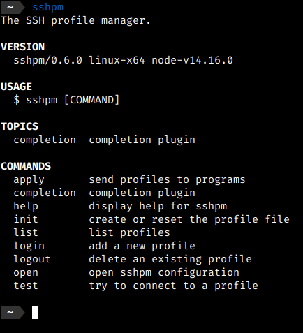
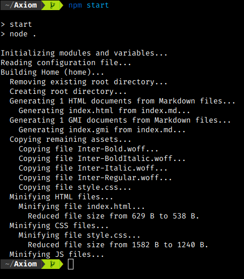
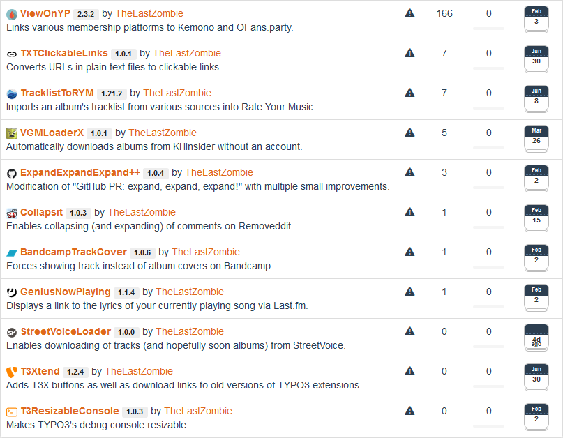
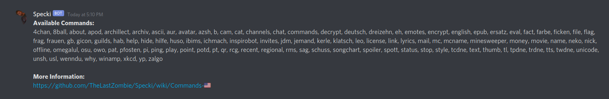
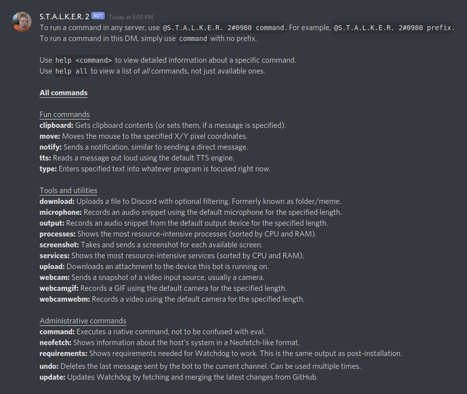

## Beep, boop. Look, it makes a sound!

Listed here are just programs I consider being my "main projects". I'm working on some other things too, feel free to [check them out](https://github.com/TheLastZombie?tab=repositories)!

### [VGMLoader](https://github.com/TheLastZombie/VGMLoader)

While VGMLoader is probably the project I'm least actively developing, it is also my most popular one.

It consists of a single AutoHotkey file and allows the user to download albums from [KHInsider](https://downloads.khinsider.com/), something that is usually only possible with a donator account.

**Language: AutoHotkey · Platforms: Microsoft Windows · License: Unlicense**

### [sshpm](https://github.com/TheLastZombie/sshpm)

At work, I usually use [ZOC Terminal](https://www.emtec.com/zoc/) to connect to our servers via SSH. But sometimes, I also need [WinSCP](https://winscp.net/) to transfer files and folders more easily, and occasionally, I prefer [OpenSSH](https://www.openssh.com/) to do some tasks more quickly.

I was fed up with having to copy the connection details between each of these programs all the time, so I wrote a command-line application to do it for me. It has since grown to support twelve different programs, some more reliably than others.

**Language: JavaScript · Platforms: Cross-platform · License: MIT**

### [Axiom](https://github.com/TheLastZombie/Axiom)

A simple static site generator (including theme) that I wrote specifically to generate and power this very site, including its subdomains.

**Language: JavaScript · Platforms: Cross-platform · License: Unlicense**

### [Userscripts](https://github.com/TheLastZombie/userscripts)

Over the years, I've also written various userscripts, mostly adding features I wanted/needed myself. All of them can be installed from GitHub, Greasy Fork or OpenUserJS.

[TracklistToRYM](https://greasyfork.org/en/scripts/411017-tracklisttorym) is definitely the one I'm most proud of, while [GeniusNowPlaying](https://greasyfork.org/en/scripts/411014-geniusnowplaying) is the one I'm using the most, and [ViewOnYP](https://greasyfork.org/en/scripts/411018-viewonyp) is by far the most popular one.

**Language: JavaScript · Platforms: Cross-platform · License: MIT**

### [Specki](https://github.com/TheLastZombie/Specki)

My first [Discord](https://discord.com/) bot and, to some extent, my first proper experience with JavaScript.

Because of this, it contains a lot of messy code and things that could've been solved better. I initially wanted to completely rewrite it, but because of its massiveness and me not really using it anymore it is now in a state of limbo instead.

**Language: JavaScript · Platforms: Cross-platform · License: Unlicense**

### [Watchdog](https://github.com/TheLastZombie/Watchdog)

My second [Discord](https://discord.com/) bot, not counting all the experiments and one-offs.

This bot resulted from a group of friends, starting with one of them jokingly making a bot that lets the others send text-to-speech messages to the person hosting it. I then made a proof-of-concept of a bot taking and sending a capture of the hoster's screen.

Fast-forward to now, and a lot of us have, as we call them, "stalk bots", that allow everyone to view our screens, video inputs (read: webcams), send notifications and more whenever we want to.

This is one of them.

**Language: JavaScript · Platforms: Cross-platform · License: MIT**
