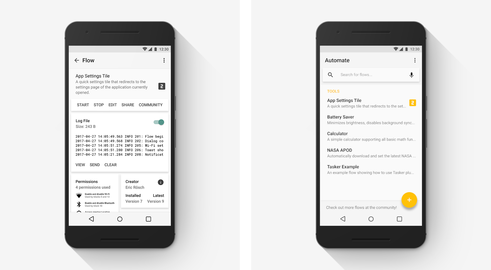
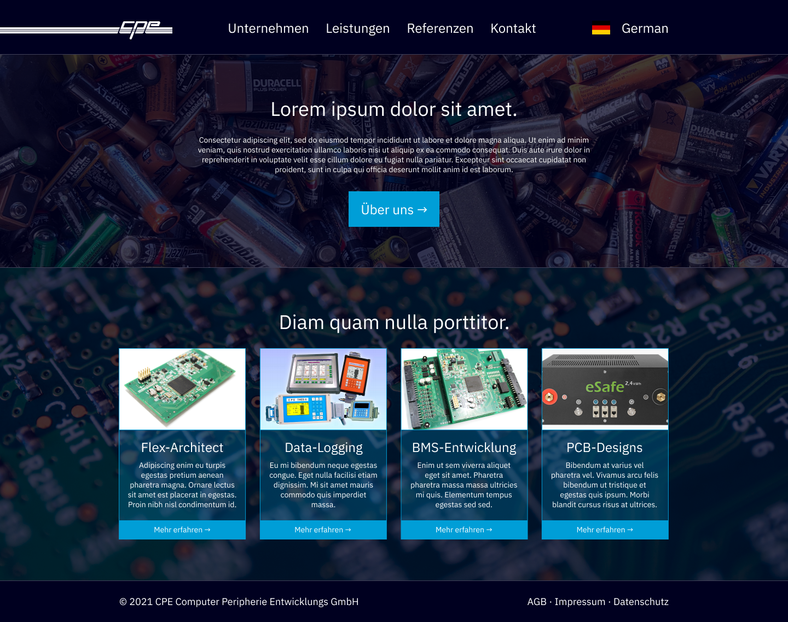

## Pixel-plumbing by yours truly.

### [Automate: Material redesign](automate.png)

Up until a few years ago, I was pretty active in the Android customization community, and [Automate](https://llamalab.com/automate/) still used a [Holo](https://android-developers.googleblog.com/2012/01/holo-everywhere.html)-like design (in fact, the screenshots on their website still do).

I thought it would be interesting to see how Automate would look like in shiny, new [Material Design](https://material.io/), so I posted a simple, single-screen mockup to its Google+ community (left).

That post got more recognition than I thought it would, so a few days later, I had a complete redesign on my hands (right).

(Here's your reminder to scroll back up and click on the heading to view all screens, and in a higher resolution too. I unfortunately don't have the project files anymore, so the original render that I posted back then is the best I can do.)

There are definitely things I'd do differently today, but it still generated an overwhelming amount of positive response. The developers behind Automate saw it too, and I'd like to think that it served as a kind of inspiration for the actual redesign that would follow some time later.

### [CPE GmbH: Website](https://www.figma.com/file/HtmQPbH8jh19D9UGDJBTdw/CPE-GmbH?node-id=0%3A1)

Just recently, a friend of mine asked me if I could design a website for one of his father's friend's company. I wanted to get a bit more into design again anyway, and wanted to finally try out [Figma](https://www.figma.com/) even more, so I said yes.

I didn't have much to go on (they didn't have a previous website or CI, only a logo), so I just did what I thought would work well, and they adopted it after a few minor changes.
