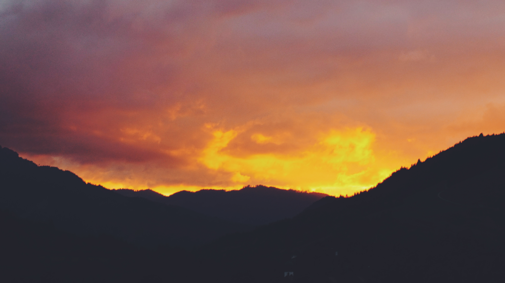
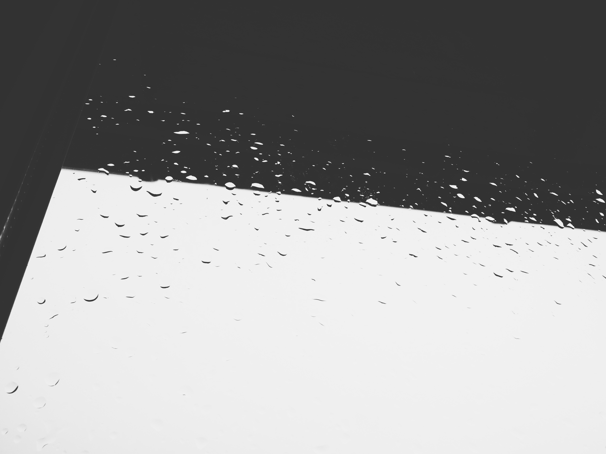
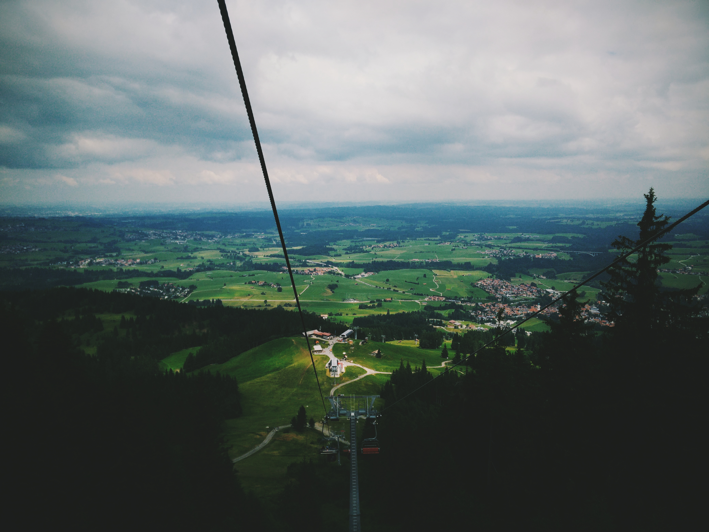
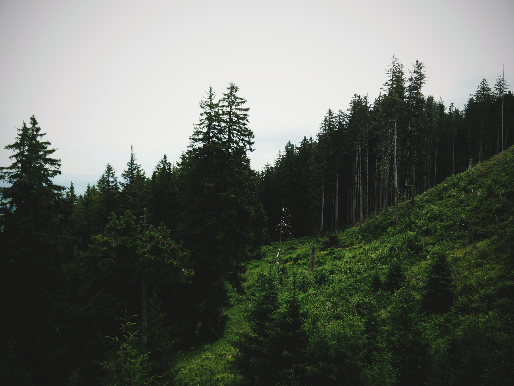

## A look into the contents of my SD card.

I publish all of my photos on [Unsplash](https://unsplash.com/@rcrsch) under what's pretty much a ["do whatever you want" license](https://unsplash.com/license). Here are just a few of my favourites.

I'd also love to get into analog photography one day, especially experimental techniques such as double exposure.

