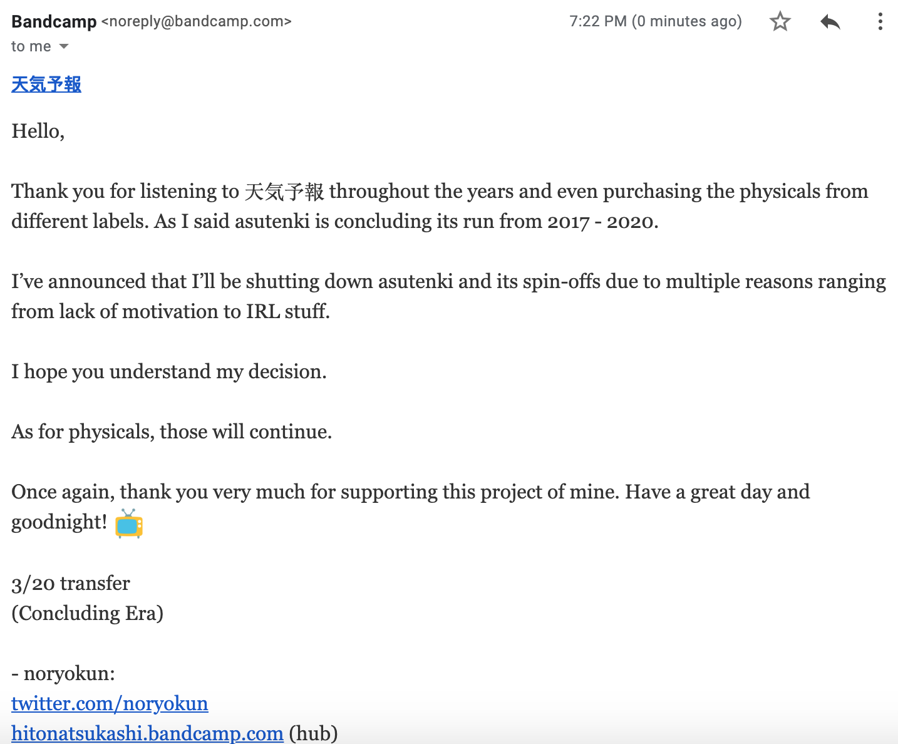
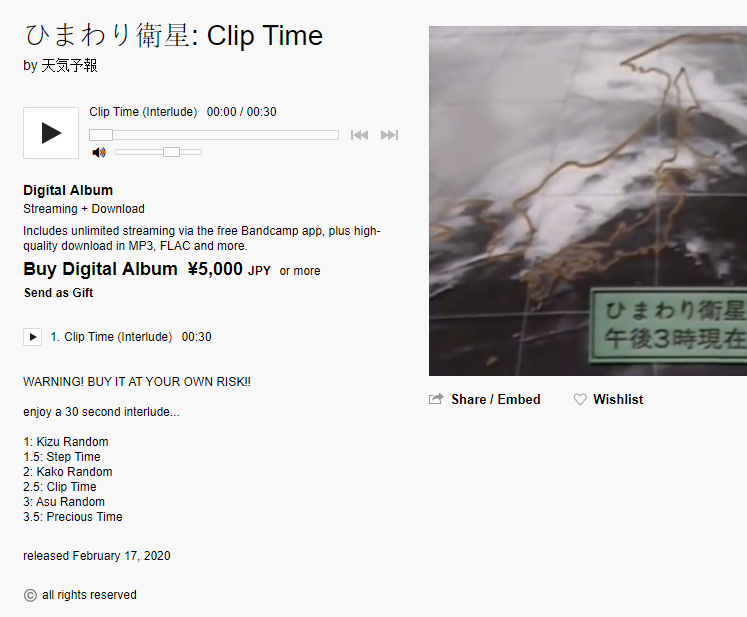
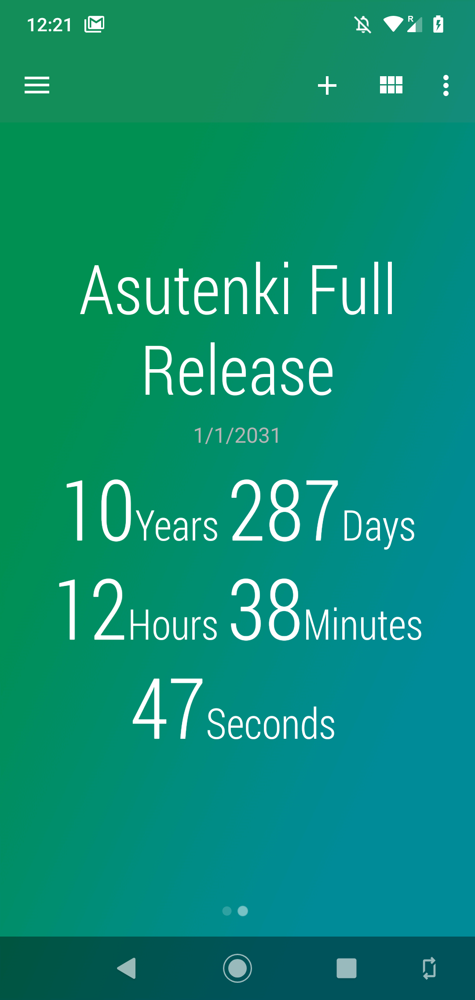

## 天気予報

[天気予報](https://asutenki.bandcamp.com/), sometimes also referred to as Asutenki or Weather Forecast, was a prominent artist in the Vaporwave genre and arguably the most popular Signalwave/Broken Transmission project.

### Conclusion

In January of 2020, 天気予報 [deleted their entire Bandcamp catalogue](https://www.reddit.com/r/Vaporwave/comments/epsl1l/apparently_%E5%A4%A9%E6%B0%97%E4%BA%88%E5%A0%B1_or_asutenki_deleted_their_entire/) which, at the time, consisted of [60 releases](https://web.archive.org/web/20191224005515/https://asutenki.bandcamp.com/). They had already announced they would soon do so in December of 2019 via [their Twitter](https://twitter.com/Noryokun/status/1207732541001650177).

Bandcamp users on 天気予報's mailing list got the following message:

### Final album

On the third of February, 天気予報 published [Kizu Random](https://archive.org/details/kizurandom-flac), the first part of ひまわり衛星, which they called the "final Asutenki album".

Two weeks later, they published [Kako Random](https://archive.org/details/kako-random-flac), the second part of said album. Both releases were removed from their Bandcamp page by now.

They also planned to publish Asu Random, the third and last part, on the second of March, [though this never happened](https://twitter.com/Noryokun/status/1233081017457504256) due to the community not being able to solve a riddle on time (see below).

Lastly, there were also thirty seconds long interludes published after each part, though only a screenshot of the second one, Clip Time, remains. None of them were archived, likely due to the high price of 5,000 JPY.

### Riddles

Throughout all of this, 天気予報 posted cryptic messages and riddles on Twitter and Bandcamp. Not many of these were solved, and even less remain today, due to the deletion of the tweet history of their [Twitter profile](https://twitter.com/asu_tenki) at least two times before setting the account to private.

One of those riddles, posted on Twitter, [would apparently lead to part three of the final album](https://twitter.com/Hitonatsukashi/status/1235103247217516544), though the community (and mainly the members of the [Vapor Archives](https://linktr.ee/vaporarchives) Discord server) were unable to solve it in time, resulting in it never being released [publicly](https://web.archive.org/web/20200301180503/https:/twitter.com/asu_tenki/status/1234171023131463681).

### Archive

Somewhere in this chaos of 天気予報 posting riddles, advancing the deadline for the third album, releasing 30 second long tracks for $60 and constantly erasing and rewriting their Twitter history, they also said they would release everything in the year 2030, and at that point pretty much everyone in the Discord server stopped caring.

After all, a number of people made backups of their purchased albums, and after the Bandcamp page went dark [a fairly comprehensive archive](https://mega.nz/#F!OpsG3SJC!M_qq3tP1FRfwnzm4Jpn-zg!K4UTgK6R) of everything 天気予報 was put together. Some releases can also be found at the [Internet Archive](https://archive.org/search.php?query=creator%3A"天気予報") or on [Bandcamp](https://bandcamp.com/search?q=%E5%A4%A9%E6%B0%97%E4%BA%88%E5%A0%B1), and at some point [ひまわり画像](https://asutenki.bandcamp.com/releases) was reuploaded to Bandcamp by 天気予報 themselves.

The entire ARG-like solving was pure chaos, which becomes apparent when reading the chat logs of the [Vapor Archives Discord server](https://discord.gg/e3eYfrA).

