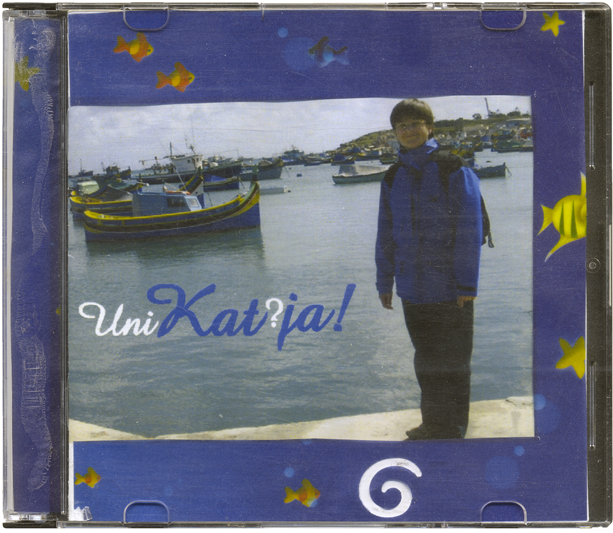
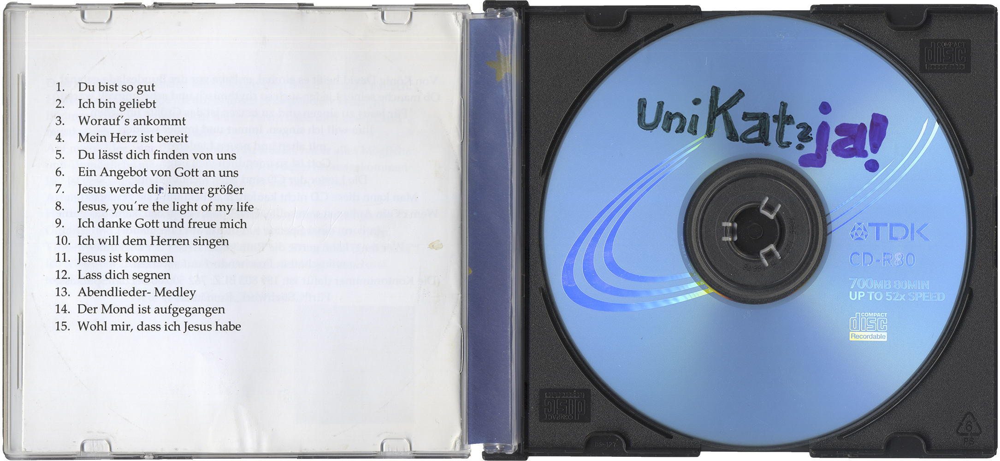

## UniKat?ja!

UniKat?ja! is an album by Katja Marks, released around 2007 by herself, likely for friends and acquaintances (Hanna Lesemann et al.).

The name of the album is a pun consisting of "Unikat? Ja!" (German for "Unicum? Yes!") and "Katja". In it, Marks sings various religious and children's songs, some of them written by herself.

The corresponding entry in the Discogs database can be found [here](https://www.discogs.com/release/14931350), an upload of the album [here](https://archive.org/details/unikatja).

### Format

The album consists of a CD in a slimcase and includes a booklet with eight pages. The blue border around the cover was affixed, the foto itself was printed.

The CD itself is a TDK CD-R80, on which "UniKat?ja!" was written by hand.

|  |  |
| -------------- | -------------- |

### Booklet

Among other things, the booklet contains a tracklist, background information and acknowledgements. The following is a transcription; I recommend the [DeepL Translator](https://www.deepl.com/translator) for translating it.

#### Page 2

**UniKat?ja!**

Im Fremdwörterbuch fand ich für "Unikat" die Erklärung: einzige Ausfertigung (eines Schriftstückes).  
König David singt in Psalm 139,14: "Herr, ich danke dir dafür, dass du mich so einzigartig gemacht hast!" (Hfa)  
Keine Frage: Jeder von uns ist ein Unikat. Eine einzige, einzigartige Ausfertigung Gottes. Von ihm gewollt, geliebt und begabt.

#### Page 3

1. *Du bist so gut*  
Text und Musik: Thea Eichholz-Müller
2. *Ich bin geliebt*  
Text und Musik: Birgit Dörnen
3. *Worauf's ankommt*  
Text: Christoph Zehendner  
Musik: H.W. Scharnowski
4. *Mein Herz ist bereit, dass ich singe und lobe*  
Text: "ein güldenes Kleinod Davids", Ps. 57, 8-11  
Musik: Katja Marks
5. *Du lässt dich finden von uns*  
Text und Musik: Katja Marks
6. *Ein Angebot von Gott an uns*  
Text und Musik: Katja Marks
7. *Jesus werde dir immer größer*  
Text und Musik: Katja Marks  
Dieses Lied ist einer genialen Puschendorfer Diakonisse zum 50.-ten Geburtstag gewidmet. Dazu gehört ein Text von C.S. Lewis, der mich zu den Zeilen inspiriert hat:

#### Page 4

Dort stand er, der riesige Löwe. Weiß schien er im Mondlicht, und große, schwarze Schatten warf er unter sich. Hätte er nicht den Schwanz bewegt, hätte man meinen können, er sei ein steinerner Löwe. Aber so dachte Lucy nicht. Sie dachte nicht einmal darüber nach, ob es ein freundlicher Löwe sei oder nicht. Sie rannte auf ihn zu. Ihr Herz- das fühlte sie- würde bersten, wenn sie nur einen Augenblick versäumte. Und alles, was sie dann wusste, war, dass sie ihn küsste, dass sie ihre Arme, soweit es nur möglich war, um seinen Nacken schlang und dass sie ihr Gesicht in der wundervollen, mächtigen Seidenweiche seiner Mähne verbarg.  
"Aslan, Aslan. Lieber Aslan", schluchzte Lucy. "Endlich!"  
Das große Tier rollte sich auf eine Seite, so dass Lucy halb sitzend und halb liegend zwischen seine Vordertatzen fiel. Er beugte sich vor und berührte ganz leicht ihre Nase mit seiner Zunge. Sein warmer Atem hüllte sie ein. Sie schaute in das große, kluge Antlitz.  
"Willkommen, Kind", sagte er. "Aslan", sagte Lucy, "du bist größer geworden."  
"Das kommt dir nur so vor, weil du älter bist, mein Kleines", antwortete er.  
"Nicht, weil du größer bist?"  
"Das bin ich nicht. Aber du wirst mich mit jedem Jahr, das du älter wirst, größer finden."  
(C.S. Lewis: Prinz Kaspian von Narnia)

#### Page 5

8. *Jesus, you're the light of my life*  
Text und Musik: Andrea Adams-Frey
9. *Ich danke Gott und freue mich*  
Text: Matthias Claudius  
Musik: Gerhard Schnitter
10. *Ich will dem Herren singen*  
Text: Arno Pötzsch  
Musik: Johannes Petzold
11. *Jesus ist kommen*  
Text: Johann Ludwig Konrad Allendorf  
Musik: Köthen um 1733
12. *Lass dich segnen*  
Text und Musik: Manfred Siebald
13. *Abendlieder-Medley:*  
Es schaukeln die Winde das Nest auf der Linde  
Text und Musik: E. Humperdinck 1884  
Der Sternanzündemann  
Text: Mascha Kaléko  
Musik: Hella Heizmann  
Der Mann im Mond  
Text: Mascha Kaléko  
Musik: Hella Heizmann
14. *Der Mond ist aufgegangen*  
Text: Matthias Claudius  
Musik: Johann Abraham Peter Schulz
15. *Wohl mir, dass ich Jesus habe*  
Text und Musik: Johann Sebastian Bach

#### Page 6

Dass ich einem so genialen Musiker begegnet bin, freut mich einfach. Heinz Wasserhess habe ich durch unsre "Pflegedienst-Feste" in Büdingen kennen gelernt. Auf diesen Feiern haben wir unsre Gäste musikalisch "in Fahrt" gebracht.  
Auf meine Idee, eine CD aufnehmen zu wollen, hat er alles Mögliche und Unmögliche möglich gemacht und was dabei herausgekommen ist, ist eine wunderschöne, vielfältige CD mit den tollsten Arrangements.  
Heinz Wasserhess ist alles in einem: Harfenist, Bigband, Organist, Gittarist und Flötenspieler, und das alles mit immer neuen Ideen. Viiiiielen DANK für die Zeit im Jahr 2007 im "Tonstudio Wasserhess"! Ich selber bin zu hören mit meiner Ovation, der Singstimme und teilweise der 2. Stimme.  
Viele Freude beim Zuhören ☺.

#### Page 7

Von König David heißt es einmal, er habe vor der Bundeslade getanzt. Ob manche seiner Lieder auch so rhythmisch und schwungvoll waren?  
Für Jesus zu singen und zu tanzen ist das Größte im Leben.  
Ihm will ich singen. Immer und immer wieder  
mit alten und neuen Liedern.  
Gott ist so unendlich vielfältig.  
Die Lieder der CD sind auch recht vielfältig.  
Man kann diese CD nicht kaufen, man bekommt sie geschenkt.  
Wem es ein Anliegen sein sollte, etwas dafür zu geben, kann das gerne in Form einer Spende tun (**muss aber niemand**!).  
Wer mag, kann gerne die Rumänien-Arbeit der Diakonie-Gemeinschaft in Puschendorf unterstützen.  
(Die Kontonummer dafür ist: 189 803 BLZ: 762 500 00 bei der Sparkasse Fürth, Stichwort "Rumänien".)

#### Page 8

1. Du bist so gut
2. Ich bin geliebt
3. Worauf's ankommt
4. Mein Herz ist bereit
5. Du lässt dich finden von uns
6. Ein Angebot von Gott an uns
7. Jesus werde dir immer größer
8. Jesus, you're the light of my life
9. Ich danke Gott und freue mich
10. Ich will dem Herren singen
11. Jesus ist kommen
12. Lass dich segnen
13. Abendlieder-Medley
14. Der Mond ist aufgegangen
15. Wohl mir, dass ich Jesus habe
