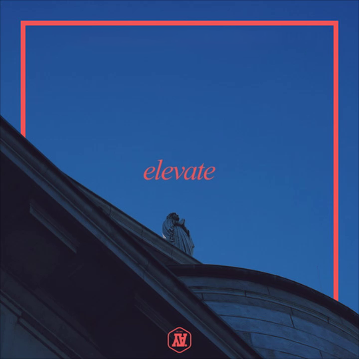
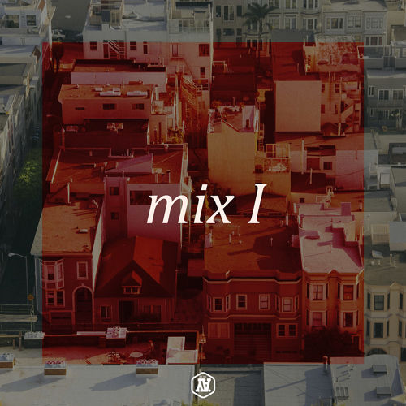

## YAbeats

YAbeats was the alias under which [Jacek Malinowski](https://twitter.com/ya_creates) from Galway published his mostly Hip-Hop-influenced tracks on [SoundCloud](https://soundcloud.com/yabeats) and [Bandcamp](https://yabeats.bandcamp.com/).

His moniker consists of "YA", from his then [YAdesign](yadesign.png) brand, and "beats".

### Discography

Due to the deletion of his SoundCloud account and the publicity of his music this list is neither complete nor sorted chronologically.

- [dopegirl](https://twitter.com/BigShel82/status/553996023849578496)
- [dreams](https://www.last.fm/music/YAbeats/_/dreams)
- elevate
- geez..
- [goldflakes](https://www.last.fm/music/YAbeats/_/goldflakes)
- [greek yogurt](https://www.youtube.com/watch?v=cobykaHIbhQ)
- [lastcall](https://www.last.fm/music/YAbeats/_/lastcall)
- [lean.](https://yabeats.bandcamp.com/track/lean)
- mix I
- [MyColorScreen Theme](https://yabeats.bandcamp.com/track/mycolorscreen-theme)
- [need to get off my ass and start creating things](https://www.last.fm/music/YAbeats/_/need+to+get+off+my+ass+and+start+creating+things)
- [Revolution!](https://twitter.com/BigShel82/status/553996028819808257)
- [un-fucking-finished](https://www.last.fm/music/YAbeats/_/un-fucking-finished)
- [WYD?](https://www.last.fm/music/YAbeats/_/WYD%3F)

### Archive

I could restore some of the tracks and covers from my hard drives. For the sake of simplicity, covers that belong to one of the tracks listed below were not included.

[lean.](https://yabeats.bandcamp.com/track/lean) and [MyColorScreen Theme](https://yabeats.bandcamp.com/track/mycolorscreen-theme) were also excluded, due to both of them still being available on [Bandcamp](https://yabeats.bandcamp.com/).

#### Tracks

- [geez..](geez.mp3)
- [goldflakes](goldflakes.mp3)
- [greek yogurt](greek-yogurt.mp3)
- [lastcall](lastcall.mp3)
- [need to get off my ass and start creating things](ntgomaasct.mp3)
- [WYD?](wyd.mp3)

I could also find the song "elevate", but only the beginning, and backed with various digicam noises.

- [elevate](elevate.mp3)

#### Covers

|  |  |  |
| ------------------------- | ----------------------- | ------------------- |

### Update

On the 15th of April, 2021, a day where I had nothing better to do, I went through my SoundCloud likes and subsequently found out that the YAbeats SoundCloud profile had never been deleted – it was simply renamed and SoundCloud didn't redirect to the new one.

Under the name [yamakethings](https://soundcloud.com/yamakethings), [need to get off my ass and start creating things](https://soundcloud.com/yamakethings/need-to-get-off-my-ass-and-start-creating-things) is still available. None of the other previously mentioned songs can be found on the page, but as of the time of writing, five new ones are available:

- [TROY flip](https://soundcloud.com/yamakethings/troy-yabeats-flip)
- [MVP Snippet](https://soundcloud.com/yamakethings/mvp-snippet)
- [roc marciano sean p - snow bootleg](https://soundcloud.com/yamakethings/roc-marciano-sean-p-snow-bootleg)
- [lee ricks - sentinel bootleg](https://soundcloud.com/yamakethings/lee-ricks-sentinel-bootleg)
- [fiyah burnin](https://soundcloud.com/yamakethings/fiyah-burnin)
